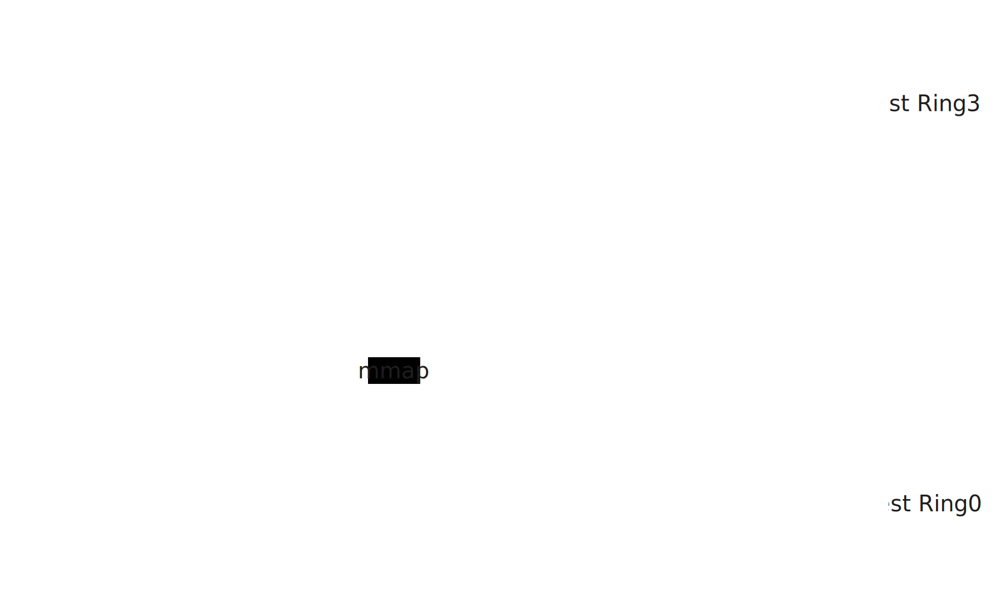

# ArceOS Syscall Forwarder —— Guest

2023210900 苏明贤

Syscall 转发流程中，涉及 Guest Linux 的有两个部分：内核驱动部分（VDEV Driver）和用户态守护进程（Shadow Process）部分。两部分参考 nimbos-driver 实现。

## Syscall转发：内核驱动部分

内核驱动部分的主要任务有：

1. 通过虚拟设备（`arceos_vdev`）向用户态守护进程提供以下功能的动态接口：
    1. 向 Hypervisor 发送 VMCALL 以传递消息，目前用于向 ArceOS 通知守护进程已经就绪；
    2. 映射 Host 和 Guest 的共享内存空间到守护进程的虚拟地址空间，从而允许守护进程和 ArceOS 中的 Syscall 处理函数双向通信；
    3. 守护进程向内核驱动告知自己的存在，以在 Syscall 到来时得到通知。
2. 当 ArceOS 的 Syscall 处理函数将 Syscall 相关信息放置到共享内存之后，会通过核间中断通知 Guest OS。内核驱动需要注册相关的处理函数，并将 Syscall 到来的信息通过信号机制通知给守护进程。

内核驱动部分以 Linux 内核中的一个模块的形式存在，目前和 Linux 内核一起编译，也可简单修改后编译为 ko，实现动态加载。内核驱动加载时，会首先创建一个虚拟设备 `/dev/arceos_vdev` 和用户态守护进程交互。`mmap` 此设备即可将共享内存区域映射到守护进程的虚拟地址空间。`ioctl` 此设备可以实现发送 VMCALL，以及告知内核驱动在 Syscall 到来时通知守护进程。内核驱动还会注册一个中断处理函数处理 Syscall 到达时 ArceOS 发送的 IPI，在此中断函数中通过信号机制通知守护进程。

## Syscall转发：守护进程部分

守护进程部分的主要任务有：

1. 初始化时映射共享内存，建立 buffer 结构。向内核驱动注册自己。最后通过内存驱动向 Hypervisor 发送 VMCALL 告知自己就绪。
2. 接受内核驱动部分发来的消息，从共享内存中取出并解析转发来的 Syscall 请求；
3. 向 Linux 内核发送 Syscall，并将返回值送回共享内存。

守护进程通过内核驱动提供的虚拟设备，以 Linux 文件接口和内核驱动通信。
